# Agent 流程图

[← 返回 README](../README.md) · [坑点清单](./04-pitfalls.md)

本文描述 FamBrain 多 Agent 的 **全局链路**、**在线编排**、**单 Agent 实现**（含规则 / 文件 / 方法），以及路由契约与 SSE 事件。

## 在线 Agent 角色

| 英文名 | 中文名 | 职责 |
|--------|--------|------|
| **`TurnStart`** | **轮次开始** | LangGraph **START 后首节点**（非 LLM）：挂 ALS 记事本、同问短路、Mem0/LangMem 注入 |
| **`TurnEnd`** | **轮次结束** | LangGraph **END 前末节点**（非 LLM）：LangMem 写入、可选静默用户记忆抽取 |
| `IntakeCoordinator` | 入口接线员 | 接收输入、理解意图、拆分任务、产出路由 JSON + **PathPlan** |
| `KnowledgeManager` | 知识管理员 | hybrid 检索（vector ∥ sparse），返回 `hits` / `coverage` / `notes` |
| **`CorpusLister`** | **语料列举器** | 纯 list 路径：目录扫盘分页（projects / experience）；**不经 KM hybrid** |
| **`PlanFanOut`** | **计划并行执行** | `fanOut` → `planSlotJoin` → **`planSlotPost`** → `planMerge`（retrieve/tool/dag 工人归各 Agent） |
| `ContentOrganizer` | 内容整理师 | planMerge 后对 `hits` 做 Zod 规范化与 path 去重，再交给分析师 |
| **全局再规划 B** | Join 后补救 | 结构失败槽改 query / 外搜；DAG 再批用 seed+下游闭包（非整图盲重跑）；`emptyPolicy` 管必答/可省略 |
| **`ToolOrchestrator`** | **工具编排器** | `toolRetrieve` + `runToolOrchestratorNode`（post-retrieval 分发，由 planSlotPost 调用） |
| **`DagExecutor`** | **DAG 执行器** | `agents/online/dag-executor`：`runDagExecutorNode` + **`runPlanDagNode`**（fan-out hybrid DAG 工人；拓扑/seed/闭包，不跑具体 tool switch） |
| **`UserFact`** | **用户记忆** | `userFactNode`（纯 remember/recall）+ **`runUserFactSideNode`**（复合并行 side-effect） |
| `InformationAnalyst` | 信息分析师 | 消费 `stepResults` + `toolResults` + 整理后的 `hits` 写终稿；可并入同轮 remember side-effect |
| **`FileAgent`** | **文件子线** | 平级图 `agents/sideline/file`：工作台 CRUD + 写回闸门 HITL。主图只 `fileHandoff` 写信封；runtime 建 FileJob 后跑本图。**禁止**直接 HITL 改 corpus md |


**链路：** 用户提问 → **轮次开始** → 意图识别 → **PathPlan fan-out**（按 `steps[]` 并行工人 → Join，可选全局 B）→ **内容整理** → **Compose**（qa / composite / summarize）→ 回答 → **轮次结束**。跨轮 cache 见 [坑点 §2.2](./04-pitfalls.md)。

### 原文库（vault workspace · 模型 A）

| 层 | 路径 | 说明 |
|----|------|------|
| 可编辑源 | `data/doc/users/<corpusUserId>/vault/originals/workspace/` | 仅 `.txt` + 用户文件夹 |
| 语料产物 | `corpus/personal/imports/workspace/**/*.md` | txt→简单 md 包装后写入；HITL **只读** |
| 向量 | Qdrant payload `path` = md repo path；`sourcePath` = vault 相对 | create/update → materialize；delete → purge |

- **未指定 path**：`operation=list`（或 UI exact-match「我的原文库」/ `__FAMBRAIN_VAULT_WS_*__`）→ 两层 list + 新建 CTA。
- **队列（可选）**：`CORPUS_QUEUE_ENABLED=1` 时 `corpus.materialize` / `corpus.purge` 入 BullMQ；worker：`pnpm --filter @fambrain/brain-service run corpus-worker`。未开队列则 **fire-and-forget** 语料化（图只提交，不等 embed；丢弃图任务不中止已提交的入库）。
- **图任务两模式：** 问答主路径只有 **停 / 换题 = discard 问答 thread + 新一轮**，不用 Resume。真正 Resume **只给文件子线 HITL 按钮**（工作台 CRUD / 写回闸门；`fambrain-file:{conv}:{fileGen}` 上 `Command({ resume: vault_action })`，**必须带 `jobId`**）。Checkpointer 是给这件事撑着的，不是给聊天暂停续写用的。
- **原文库人等：** 在 **文件子图** 每次 list/CRUD 后 `interrupt({ kind: vault_wait })`；点按钮才 Resume。对人可见的 list/CTA 以 **interrupt 载荷** 为准（`answer`/`blocks`）；stream `values` 在 interrupt 时可能缺 channel，**合入**已有 `answer`/`blocks`，禁止整帧覆盖。
- **写回闸门：** 主图 Analyst / ContentSummarizer 之后 → `fileHandoff`（只写信封）→ **`persistTurnEnd`（会跑）** → END。runtime 再开文件图 `saveHitl` 一次 interrupt。出闸只给**新材料**：`attachmentAction` 为 `summarize`/`translate`，或粘贴长文总结（`composeMode=summarize` / `intent=summarize_content` 且无 `searchQuery`、无 pathPlan 步）。**查库摘要、普通 QA、extract 不出闸。** 聊天是 **两条助手消息**：主图终稿 `done`，再短 CTA + 按钮 `paused`。确定入库 = `clientHandler: vault_save_name` → **文件名弹窗**（确认才 Resume，关闭弹窗不 Resume）；取消 = Resume 不写盘。写入 workspace 根目录 `.txt` + materialize（图不等 embed）。
- **新问 vs HITL：** 新 QA **不**作废 save_offer 按钮；**会**顶替 workspace HITL。同会话一个活跃 FileJob；新文件任务 supersede 旧文件 thread。TTL 30min → job `cancelled` + `discardFileTask`。同问短路不启动文件子线。Resume 无 `jobId` → HTTP 400。
- **三条写路径勿混：** ① 语料页批量 `ingestDocumentBatch`（原件→corpus）；② 工作台 CRUD（用户编辑 txt）；③ 写回闸门（本轮终稿→txt）。**聊天附件不再 ingest**；LLM 若仍输出 `ingest`，schema 合法化为 `summarize`，走总结后再出闸门。
- **生成停：** 流式中点「停止」→ 半截稿即终稿，**discard 问答 thread**。无「继续」。不接同一条 Ollama 采样。
- **丢弃：** 新问题 / 编辑重跑 / 显式停止 / 生成停 = discard **问答** thread。文件 thread 仅在新文件任务 / workspace 被非原文库问顶替 / TTL 时 discard。点「确定入库」后改问：丢弃文件任务，**不中止**已提交的语料化。
- **UI 按钮：** 启用/禁用以后端 Prisma `Message.metadata.blocks[].actions[].disabled` 为准；新问作废 workspace 按钮但 **保留** save_offer（`keepFileJobIds`）。
- **写路径**：`kind=vault_workspace` CRUD `vault/originals/workspace/*.txt`；语料化 md+向量；硬删级联。不再直接改 corpus md。
- **UI stale：** 列表/打开/删除按 `vault:cwd:<folder>` 分组；**新建 txt/文件夹**走 `vault:create:<cwd>`；写回闸门按钮走 `vault:save`（`apps/web/src/lib/chat/action-lifecycle.ts`）。

**PathPlan 有序 steps（2026-07 · 端到端）：** Intake LLM 直接产出 `pathPlan.steps[]` + `composeMode`（数组顺序 = 回答/执行顺序；`answerOrder` 可选）；pipeline **合法化 + 结构归一**（`dataSource`/`userFactKey`/`identityField`/`toolId` 族修正 kind）并派生 `compositeSlots`。LangGraph：**纯 list** → `listRetriever` → `contentOrganizer` → `analyst`；**纯总结（无查库）** → `contentSummarizer`；**复合** → `planCacheResolve` → `planFanOut`（每槽 `Send`→`kmRetrieve`/`listRetrieve`/… ∥`planDag`→Join 可选全局 B→`planMerge`）→ `contentOrganizer` → `analyst`。步可带 `emptyPolicy`（require/omit/degrade）。SSE 按真实图节点报步骤。

**架构双线（2026-06，目录 2026-07 对齐）：**

| 线 | 目录 | 编排 |
|----|------|------|
| **在线 Agent 实现** | `agentflow/agents/online/`（含 `tool-orchestrator/`） | 各 Agent 图节点；`file-handoff/` 只写信封 |
| **文件子线（平级图）** | `agentflow/agents/sideline/file/` | 独立 compile `fambrain-file`；runtime `orchestrateAgentStream` 调用 |
| **编排骨架 + SSE** | `agentflow/pipeline/` | 主图 `graph/` + `runtime/stream.ts`；双图编排 `runtime/orchestrate.ts` |
| **离线** | `agentflow/agents/offline/` | 手动脚本：Indexer / DocParser 等 |
| **工具定义** | `agentflow/tools/` | LangChain StructuredTool（被 tool-orchestrator 调用） |

架构演进详见 [架构 v2 §9 代码布局](./05-architecture-v2-tool-orchestration.md#9-代码布局演进2026-07)、[§10 列举 per-slot](./05-architecture-v2-tool-orchestration.md#10-列举执行-per-slot-演进-2026-07)。

## 全链路总览（离线入库 + 在线对话）

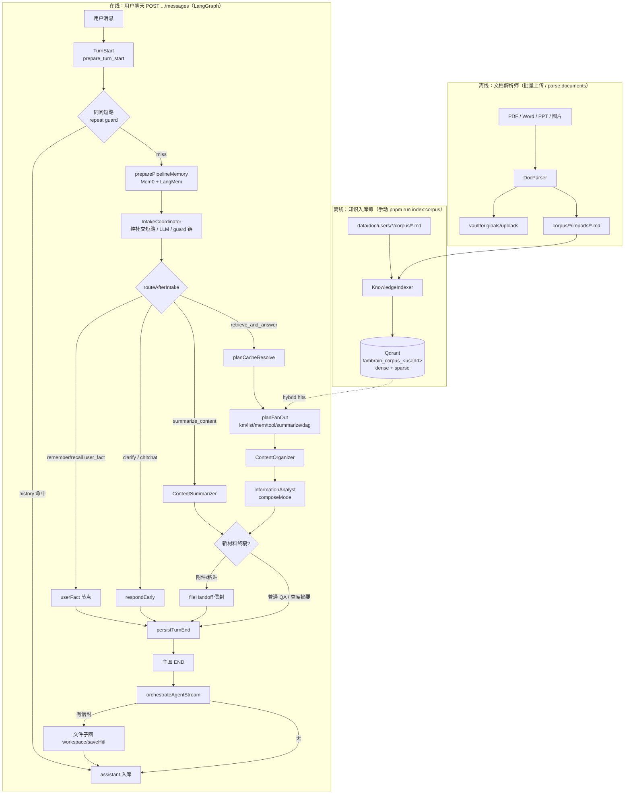

## 在线编排流程

入口接线员只输出 **JSON 路由决策**；**进哪个节点由 LangGraph 查表决定**（`IntakeRoutingDecision` 见 `agentflow/agents/online/intake-coordinator/prompt.ts`），不是模型在回复里写「下一个 Agent 名字」。

**Pipeline 目录（2026-06 方案 2 · 2026-07 对齐）：**

| 子目录 | 职责 | 关键文件 |
|--------|------|----------|
| `pipeline/graph/` | **LangGraph 骨架**：状态、条件路由、节点注册 | `state.ts`、`routes.ts`、`compile.ts`（~50 行） |
| `pipeline/runtime/` | **SSE 运行时**：初始 state、耗时、stream 消费 | `initial-state.ts`、`pipeline-timing.ts`、`stream.ts` |
| `agents/online/*/` | **节点业务**：各 Agent 的 `*-node.ts`（含 **`tool-orchestrator/`**） | 见下表 |
| `agents/offline/*/` | **离线脚本**：Indexer / DocParser | — |
| `tools/` | LangChain 工具定义 | `retrieve-corpus.ts`、`search-web.ts` 等 |
| `utils/` | 跨 Agent 小工具 | `json-parse.ts`、`zod-utils.ts` |

实现：`pipeline/graph/compile.ts`（只注册节点 + 连边）· `pipeline/runtime/stream.ts` → `runPipelineStream()`（主图 SSE）· `runtime/orchestrate.ts` → HTTP `runAgentStream`（主图 END 后可选文件子图）。

**`runtime/stream.ts` 仅负责：** SSE 推送、`PipelineTimingTracker`、Pipeline 出去日志；**不**含 Mem0 读写或检索 cache 业务。interrupt 时 HITL 正文取 interrupt 载荷；`values` 合入已有 channel，不整帧覆盖。

**D5-2 / P0-15 三层 cache（2026-06 · env 可关）：**

| 层 | 位置 | Key / 条件 | 命中后 | 关闭 |
|----|------|------------|--------|------|
| **同问短路** | **`repeatQuestionGuard` 节点**（`repeat-question-guard/nodes/repeat-question-node.ts`） | `normalize(userQuestion)` + history 中已有 assistant 答 | `repeat_respond_early` → 复用答案（`repeatQuestionHit`）→ `persistTurnEnd` | `REPEAT_QUESTION_CACHE_DISABLED=1` |
| **检索结果 cache** | `agentflow/cache/`：`planCacheResolve` 预查；live miss 后 `writeHitsCache` | `{prefix}:retrieval:v1:…` | 进 KM 前读；retrieve 后写；仍走 Organizer / Analyst | `RETRIEVAL_CACHE_DISABLED=1` |
| **composite 终稿 cache** | `agentflow/cache/resolve-composite-plan.ts` + `packages/infra/.../composite-answer-cache.ts` | 同会话 `conversationId` + `corpusUserId` + **facetKey**（`{桶}:{字段或列举类}:{归一化 searchQuery}[:p页]`） | `planCacheResolve` 全量 facet 查表；命中槽跳过 KM | `COMPOSITE_ANSWER_CACHE_DISABLED=1` |

清空 Redis / memory：`pnpm --filter @fambrain/brain-service exec tsx --env-file=../../.env scripts/clear-pipeline-cache.ts`（改 env 后须**重启 agents** 清进程内 memory）。

同问短路解决 Intake 非确定性导致「同句再问 searchQuery 变、公司数降级」；检索结果 cache 解决问法不同但 Intake 产出相同 `searchQuery` 的场景（如 eval `CACHE-G4-repeat`）。

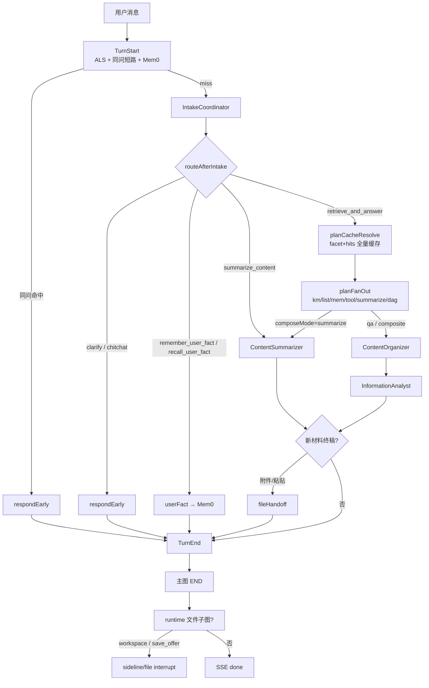

## 单 Agent 实现流程

每个 Agent 一张图 + 步骤表（**规则 / 文件 / 方法**），便于对照代码。

### 0. TurnStart — 轮次开始 ✅

**触发：** 每轮 LangGraph **必经**首节点 `prepareTurnStart`（`START → prepareTurnStart`）。**非 LLM**。

**职责：**

1. stream 入口 `createPipelineRunStore` + `configurable.pipelineRunStore`；图节点 `withPipelineRunAls` 包一层 — 本轮 ALS（token 统计 + `pipeline_log` 队列）
2. **同问短路** `findRepeatAnswerInHistory` — 命中 → `exitEarly` + `respondEarly`
3. `preparePipelineMemory` — Mem0 检索 + LangMem 摘要 → 写入 state 的 `memoryBlock` / `intakeHistory` / `userMemories`

**代码：** `agentflow/agents/online/prepare-turn-start/` · 图节点 `compile.ts` · SSE step 名 **`prepare_turn_start`**（UI：准备上下文）

**验证：** `pnpm run verify:repeat-question-smoke`（同问短路，无 Ollama）；全链路见 `golden:regression` / `eval:run`。

### 0.5 TurnEnd — 轮次结束 ✅

**触发：** 每轮 LangGraph **必经**末节点 `persistTurnEnd`（`userFact` / `analyst` / `respondEarly` → `persistTurnEnd` → `END`）。**非 LLM**。

**职责：**

1. `persistPipelineMemory` — **仅** LangMem 会话摘要（已废除整轮 `addTurnToMem0`）
2. `persistUserMemoryAutoLearnAfterTurn` — 可选独立 LLM 静默抽结构化事实 → Mem0（`USER_MEMORY_AUTO_LEARN_ENABLED`；显式 userFact 轮次跳过）
3. **跳过：** `repeatQuestionHit`、空 `answer`、`turnAborted`

**代码：** `agentflow/agents/online/persist-turn-end/` · SSE step 名 **`persist_turn_end`**（UI：写入记忆）

**验证：** 闲聊/检索链末步应为 `persist_turn_end`；同问短路仍会经过 `persist_turn_end`（内部 no-op）。

### 1. KnowledgeIndexer — 知识入库师 ✅

**触发：** 手动 `pnpm run index:corpus`（语料 md 变更、换 embed 模型、改分块规则后重跑）。**不参与**用户聊天实时链路。

**技术：** Qdrant（`@qdrant/js-client-rest`）+ Ollama Embed（`@fambrain/corpus`）、Zod（payload metadata）、Pino；单文件更新另见 HITL `upsertCorpusDocumentsByPath`。入库跳过 `readme.md` / `_template.md`。

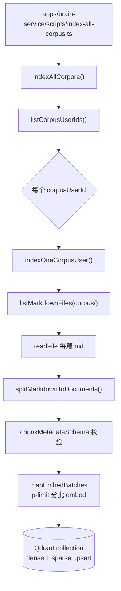

| 步骤 | 做什么 | 规则 | 文件 | 方法 |
|------|--------|------|------|------|
| 0 | CLI 入口 | 加载 `.env`；失败 exit 1 | `apps/brain-service/scripts/index-all-corpus.ts` | — |
| 1 | 找用户 | `data/doc/users/*` 下 corpus 至少有 1 个 `.md` | `list-corpus-users.ts` | `listCorpusUserIds()` |
| 2 | 路径约定 | 语料根 `users/<id>/corpus/` | `packages/corpus` | `getUserCorpusRoot()` |
| 3 | 扫 md | 递归 `.md`；跳过噪声路径（README / `_template.md`）与 `vault/originals/images/...` | `packages/corpus` | `listMarkdownFiles()`, `toRepoPath()`, `isCorpusNoisePath()` |
| 4 | 读正文 | UTF-8 读全文 | `index-one-user.ts` | `readFile()` |
| 5 | 分块 | 按 `##` 切；无 `##` 整篇 1 块；`id_`=user:path:index | `split-markdown.ts` | `splitMarkdownToDocuments()` |
| 6 | metadata | path / title / chunkIndex / corpusUserId | `chunk-metadata.ts` | `chunkMetadataSchema.parse()` |
| 7 | embed | `OLLAMA_MODEL_EMBED`（默认 nomic-embed-text）；**p-limit** 限制并发批次数 | `embed-batches.ts`, `index-one-user.ts` | `mapEmbedBatches()`, `getEmbedIndexOptions()` |
| 8 | 存 Qdrant | collection=`fambrain_corpus_<userId>`；named vectors `dense`+`sparse`；跳过 README/模板 | `index-one-user.ts`、`packages/corpus` | `indexCorpusDocuments()` |
| 9 | 日志 | JSON 结构化 | `index.ts` | `indexerLogger`（pino） |

**前置：** Qdrant 可访问（`pnpm run qdrant:server` 或 `pnpm dev`）；Ollama 可访问且已 pull embed 模型。

### 2. IntakeCoordinator — 入口接线员 ✅

**职责：** 只产 **路由 JSON**，不写终稿、不检索。

**技术：** `completeChat` / `streamChat`（`CHAT_PROVIDER=ollama|openai`）；输出 **Zod**（`intakeRoutingSchema`）。

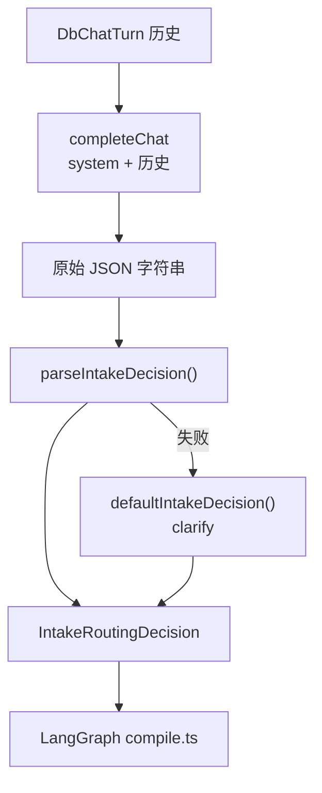

| 步骤 | 做什么 | 规则 | 文件 | 方法 |
|------|--------|------|------|------|
| 1 | 拼 prompt | 系统指令定义 intent / searchQuery 等 | `IntakeCoordinator/prompt.ts` | `prompt` |
| 2 | 调模型 | 一次非流式 `completeChat`；`CHAT_PROVIDER=openai` 时用 `OPENAI_MODEL`（默认 deepseek-v4-flash，thinking disabled）；否则 `OLLAMA_MODEL_INTAKE_COORDINATOR` | `IntakeCoordinator/llm/complete.ts` | `completeIntakeCoordinator()` |
| 3 | 解析 JSON | 抠 JSON → **Zod parse**；`userFact*` 缺省视为 `null`（勿误 fallback 检索） | `intake-coordinator/pipeline/parse-intake.ts`, `schema.ts` | `parseIntakeDecision()`, `intakeRoutingSchema` |
| 4 | 兜底 | 解析失败 → `defaultIntakeDecision()`（**clarify**，不瞎 retrieve） | `pipeline/parse-intake.ts` | `defaultIntakeDecision()` |
| 5 | Guard 链 | parse 后依次 guard（见下） | `pipeline/intake-pipeline.ts` | `runIntakePipeline()` |
| 6 | 编排 | LangGraph 条件边 | `pipeline/graph/routes.ts` + `compile.ts` | `routeAfterIntake()` 等 |

**Guard 链：** `intake-node` 短路 → Intake LLM（retrieve 须 **`pathPlan.steps`≥1**；`answerOrder` 可选）→ `runIntakePipeline`：continuation noop → early-exit → link harmonize → **legalize PathPlan** → fill list 页码 → **派生 compositeSlots**（空 pathPlan→clarify）。

**端到端 PathPlan：** Intake **主路径** = LLM 执行终稿（有序 `steps[]`，`kind` = km|list|mem|tool|summarize|dag|**vault_workspace**）；**旁路** = normalize / JSON 修复 / 结构归一与派生。勿把散文兜底当成二次 Intake。旧 `retrievalPlan` 编译链与 `composite-route-guard` 已删除。

**TurnTrace（运行轨迹入库）：** 每轮对答结束时 BFF 将 `timing`（含 `tokens.byNode`）+ `steps` + `pipeline_log` 写入 `TurnTrace`（键=助手 `messageId`）；进行中仍走 SSE；历史由 `GET /api/conversations/[id]/traces` 回放至运行日志面板（Token 分节点 + 耗时）。**引用：** Analyst `citations` 经 SSE / `pipeline_done` / 消息 metadata 落库，聊天气泡下方 `MessageCitations` 展示。

**P0-30 补充字段：** `identityField` 含 **`tenure`**（从业年限 → `compute_tenure_from_hits`）；`enumerationControl.timeWindowYears`（近 N 年列举过滤）。合并/拆分以 Intake LLM 为准；规则见 `.cursor/rules/no-scene-hardcoding.mdc`。

**queryType 扩展：** 除 identity / enumeration / tech / default 外：

- **`external_link`**：GitHub、仓库、对外 URL；与 KM `queryProfile` 同名，**不走** enumeration projects fill。外链抽取工具 `extract_external_links_from_hits` 在 **tools 层**；Intake 只声明 `queryType=external_link` + `toolId`。
- **`relations`**：语料亲友名册。槽 `topics` 含 `"family"` 时 `from-llm` 落 `queryType=relations` 并清 `identityField`（**只信槽字段，不扫问句「哥哥」**）；KM 只滤 `docKind=relations`。**不是** `identityField=name`、**不是** mem。`identity`+`name` 且无 family → 仍只搜档案。详见 [km-retrieval-design §六](./km-retrieval-design.md#六queryprofile-参数表)。

**单问 / 多问统一路由：** Intake 出口 `resolveIntakeGraphRouteMode` 写入 **`routeMode`（与图节点 1:1）**；`routes.ts` 只读分发。优先级：**vault_workspace → fileHandoff**；其余 **userFact → respondEarly → …**（remember/recall 进 **userFact**；**仅一步 mem** 结构折叠为 recall 早退）。km/list/mem/tool/summarize/dag 并存 → `planFanOut`。空 pathPlan → `respondEarly`（clarify）。dag **仅** `hybrid_multi_source`。独立工具（如 `search_web`）→ `toolRetrieve`；扩展天气等同族只需加 `TOOL_RUN_IDS` + execute，无需新 PathKind。原文库 CRUD **不进 fan-out**，主图 `fileHandoff` → persistTurnEnd，HITL 在文件子图。

**外链 / 混合：** `applyIntakeLinkLookupGuard` 仅做 **harmonize**。编号拆槽、混合步序由 **LLM 写齐 `pathPlan.steps[]`**（数组顺序即答序），代码不发明、不重排。列举分页 / UI exact-match 实现在 **`corpus-lister/enumeration`**（Intake `enumeration/` 仅 re-export）。详见 [坑点 §2.8](./04-pitfalls.md#28-pathplan-统一编排-p0-28--2026-07)、[§2.10](./04-pitfalls.md#210-intake-档-b主路径规划--旁路纠偏-p0-31--2026-07)。

### 2.4b 原文库写盘 vault_workspace — 阶段 6 ✅

直接改 `corpus/**/*.md` 的 HITL `corpus_edit` 已删除。用户可编辑源只走 `vault_workspace`（`vault/originals/workspace/*.txt`）；语料 md + 向量由 materialize/purge 级联。见上文「原文库」。

**工作台：** `kind=vault_workspace` 独占单槽 → 主图 `fileHandoff` → `persistTurnEnd`（不进 Join / fan-out）。文件子图 `workspace` interrupt 循环。HITL「结束」exact-match `__FAMBRAIN_VAULT_WS_DONE__`。列表覆写同一条 followup 消息。

**写回闸门：** 文件子图节点 `saveHitl`（包 `sideline/file/save-hitl/`）。附件 summarize/translate 或粘贴长文总结终稿 → 主图先 `persistTurnEnd`，再文件图一次 `interrupt(vault_wait)` → 确定入库（文件名弹窗）写 txt + materialize，或取消不写盘。查库摘要当阅读，不出闸。写盘复用 `sideline/file/vault` op。Eval：`golden.json` → `vaultWorkspaceProbe` 含 `save_gate_*` / `resume_requires_jobid`。

### 2.5 跨会话用户事实 userFact — P0-16 ✅

**职责：** 用户自述联系方式/账号（QQ、手机、邮箱、微信等）的 **记住** 与 **跨 conversationId 召回**；不经 KM / Analyst，直接读写 Mem0（Qdrant）。

**设计要点：**

| 层 | 模块 | 行为 |
|----|------|------|
| **Intake schema** | `prompt.ts` + `schema.ts` | `intent`: `remember_user_fact` / `recall_user_fact`；字段 `userFactKey` / `userFactLabel` / `userFactValue` |
| **路由** | [`user-fact/user-fact.ts`](../apps/brain-service/src/agentflow/agents/online/user-fact/user-fact.ts) | `isUserFactIntent` + `routeUserFactFromIntake()`；**不靠问句 regex 词表** |
| **编排** | `routes.ts` | Intake 后 `remember_user_fact` / `recall_user_fact` → **userFact 节点** → persistTurnEnd |
| **Mem0** | `mem0/store.ts` | `addStructuredUserFact()` 写入；`searchUserFactMemories(factKey, label, question)` 语义检索 |
| **值提取** | `user-fact.ts` | `extractByFactKey` + `validateFactValueForKey`；Mem0 行如 `QQ号是734858469` 须提取完整号码（勿误切「码」） |

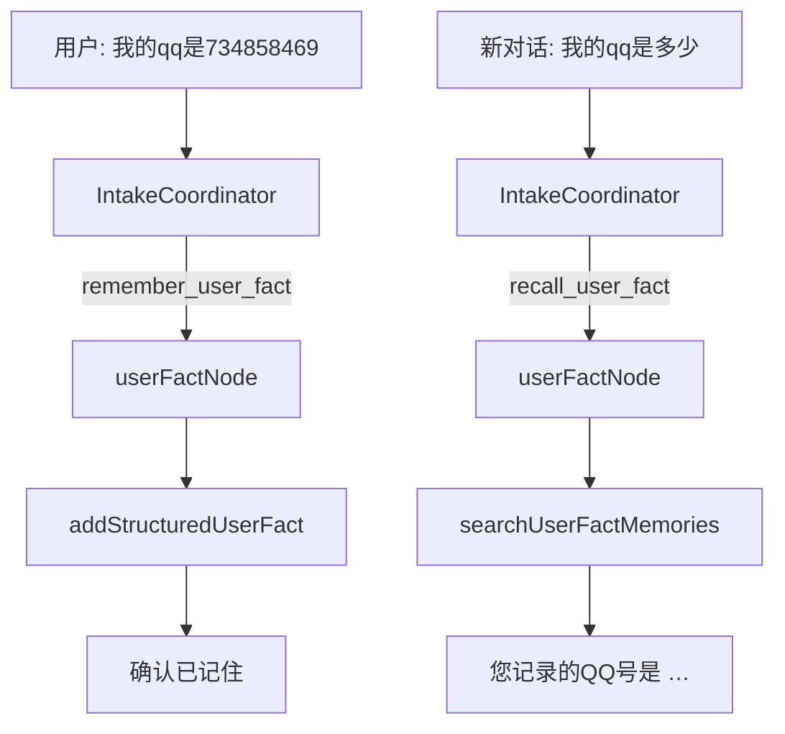

| 步骤 | 做什么 | 文件 | 方法 |
|------|--------|------|------|
| 1 | Intake 产出 schema | `intake-coordinator/prompt.ts` | `remember_user_fact` / `recall_user_fact` 示例 |
| 2 | 解析路由 | `user-fact.ts` | `routeUserFactFromIntake()`、`findUserFactValueInTexts()` |
| 3 | 写入 / 召回 | `user-fact/nodes/user-fact-node.ts` | `userFactNode()` → Mem0 |
| 4 | SSE | `stream.ts` | step `user_fact` |

**验证：** `pnpm --filter @fambrain/brain-service run verify:user-fact`（跨 conversationId A 记 → B 问）。**改 agents 代码后须重启服务**；与 Pipeline cache 无关。

### 3. KnowledgeManager — 知识管理员 ✅

**职责：** 产出 `hits[]`（path / excerpt / relevance），不对用户说话。

**技术：** **纯规则精排**（无 LLM）。**Hybrid 召回**（Qdrant dense + sparse prefetch，**引擎内加权 RRF**）→ `tokenize` + `pickExcerpt` 确定性输出。与业界「检索层不用 Chat LLM、生成留给 Analyst」一致；避免小模型在精排阶段改写 excerpt、编造 `notes`（见 [坑点 P0-4 / D3-3](./04-pitfalls.md)）。

> **v3 设计：** Hybrid + RRF 已接入；Intake `queryType`、confidenceTier、列举分流见 [km-retrieval-design.md](./km-retrieval-design.md)。列举分页走 **CorpusLister**（目录扫盘），不经 KM hybrid。

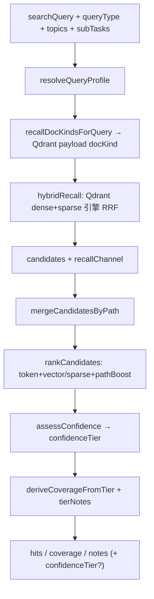

| 步骤 | 做什么 | 规则 | 文件 | 方法 |
|------|--------|------|------|------|
| 1 | Hybrid 召回 | Qdrant dense + sparse prefetch；引擎加权 RRF；topK 按 profile；**按 queryType 滤 `docKind`**（空过滤不回退全库） | `hybrid-recall.ts`、`profile/recall-doc-kinds.ts`、`packages/corpus` | `hybridRecall()` → `searchCorpusHybrid()` |
| 2 | 关键词扫盘 | ~~查询时扫盘建内存 BM25~~ **已移除**（sparse 在入库时写入 Qdrant） | — | — |
| 3 | 规则精排 | **token + vector + pathBoost**（排序用未封顶分；`KnowledgeHit.relevance` 再 clamp 0–1）；`pickExcerpt`（表格行优先） | `retrieve-helpers.ts` | `rankCandidates()`、`pickTableExcerpt()` |
| 4 | 置信分档 | 融合分 + gap + path 权威 → `high` / `mid` / `low` | `score-candidate.ts` | `assessConfidence()`、`deriveCoverageFromTier()` |
| 5 | 输出 | **maxHits 按 profile**；可选 `confidenceTier` | `types.ts` | `KnowledgeRetrievalResult` |

### 4. FactChecker — 已删除

主链 **FactChecker 模块与打回再检索环已移除**（`apps/brain-service/.../fact-checker/` 已删）。  
失败槽补救改为 **`planSlotJoin` 后全局再规划 B**（≤1），见 [控制面 §6](./06-architecture-control-plane.md)。  
`StepResult.fc` 仍为工人占位字段，兼容下游，不再表示真实核查。

### 5. InformationAnalyst — 信息分析师 ✅

**职责：** 据整理后的 `hits` 写终稿；无证据时 `insufficientEvidence`，禁止编造履历。

**P0-12（2026-06-18）：** `hits.length===0` 或 `coverage==="none"` 时 **`shouldSkipAnalystLlm`** 不调 Ollama，直出 `buildFallbackAnswer`（日志 `rules_empty_hits_skip_llm`）。年龄/姓名单问空 hits 有字段化文案（2026-06）。**P0-18（2026-06）：** slot + 槽答案缓存命中时不再误走空 hits 兜底，见 [坑点 §2.5.4](./04-pitfalls.md#254-单问年龄--多轮-cache-p0-18--2026-06)。

**P0-15 composite（2026-06）：** `compositeSubResults.length ≥ 2` → **`stream-composite.ts`** 顺序分问 token 流式；槽答案缓存 命中 instant 回放；新 facet 写回 `composite-answer-cache`。≥2 槽跳过 FactChecker LLM。

**P0-19 / P0-20（2026-06）：** 单问 `identity` / `enumeration` / `default` 走 **plain-text 流式**（与 composite 子问同路径，`think: false`），避免 JSON 解析失败退回「根据知识库摘录」体；hits 上限与 KM **queryProfile** 对齐（`analyst-recall-limits.ts`）；ContentOrganizer 按 profile 设 `maxHits`。详见 [坑点 §2.5.5](./04-pitfalls.md#255-analyst-纯文本流--enumeration-项目公司分流-p0-19--p0-20--p0-21--2026-06)。

**P0-24（2026-07）：** 四类数据源架构 — Intake `applyToolPlanGuard` 富化 `enrichedPlan` / `executionPlan`；**`toolOrchestrator`** 跑具体 tool；混合评估走 **`dagExecutor`**（`agents/online/dag-executor`）。年龄从 Analyst 内联上移到编排层；`prepareTurnStart` 注入 `asOfDate`。详见 [架构 v2](./05-architecture-v2-tool-orchestration.md)。

**P0-26（2026-07）：** 列举执行从整句 **`routeMode=list`** 改为 **per-slot** `enumerationControl` + `executor`；`retrieval-node` 可同轮混跑 KM hybrid 与 list API。详见 [坑点 §2.5.10](./04-pitfalls.md#2510-列举执行-per-slot-架构升级-p0-26--2026-07)。

**P0-23（2026-07，已被 P0-24 吸收）：** composite / 单问 **identity 年龄槽** → `compute_age_from_hits`；原 `resolveOrchestratedTool` 在 Analyst 内，现优先走 `state.toolResults`。详见 [坑点 §2.5.7](./04-pitfalls.md#257-identity-年龄编排工具-p0-23--2026-07)。

**技术：** composite / 单问列举 / **identity 年龄** → **编排工具或 plain-text 流式**；`tech` 单问仍 JSON **Zod**；fallback 为紧凑列表（非 raw excerpt 粘贴）。

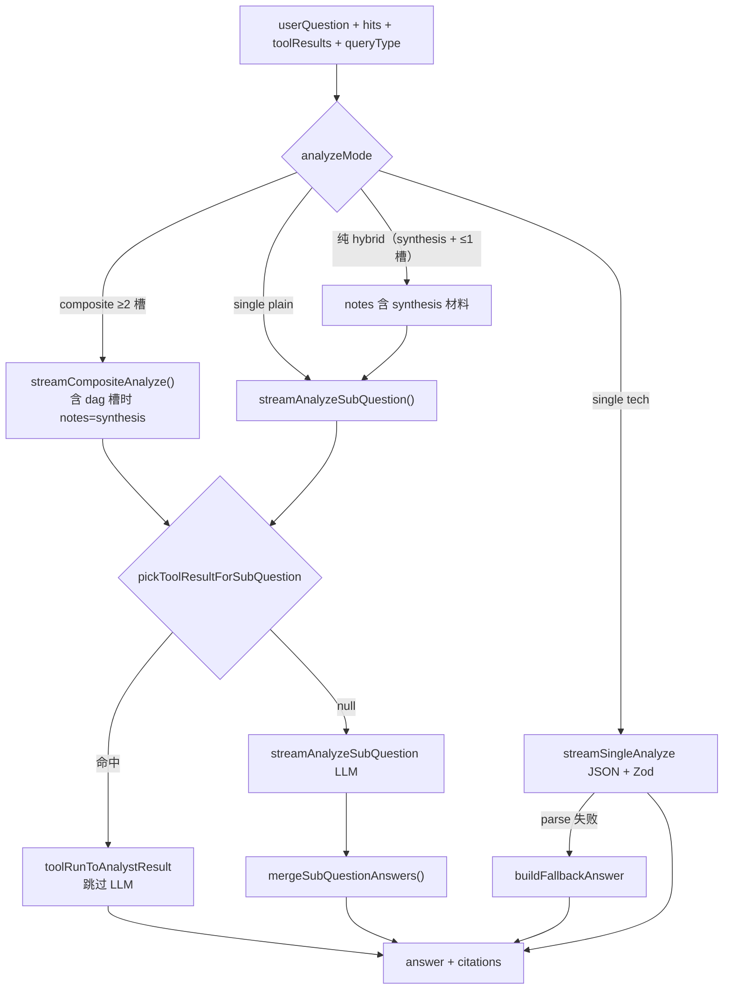

| 步骤 | 做什么 | 规则 | 文件 | 方法 |
|------|--------|------|------|------|
| 1 | 输入 | hits + **queryType** / **topics**（来自 Intake） | `InformationAnalyst/prompt.ts` | `InformationAnalystInput` |
| 2 | 空 hits 短路 | **P0-12** 不调 LLM | `analyze-helpers.ts` | `shouldSkipAnalystLlm()` |
| 3 | profile 上限 | enumeration **8** / identity **4**（非固定 4） | `analyst-recall-limits.ts` | `maxAnalystHitsForProfile()` |
| 4 | 流式 | composite + 单问列举 → **rules Composer**（不调 LLM）+ `ui_block`；tech → JSON | `compose-message.ts`, `stream-composite.ts` | `composeEnumerationAnswer()`, SSE `ui_block` |
| 5 | 子问 prompt | identity/tech 仍 LLM；**enumeration 不走 LLM** | `analyze-helpers.ts` | `shouldSkipSubQuestionLlm()` |
| 6 | fallback / blocks | **序号 + 项目名**（无 excerpt）；`enumeration` 表格块 + `paginationHint` | `enumeration-format.ts`, `compose-message.ts` | `formatHitsAsAnswerList()`, `buildEnumerationBlock()` |
| 7 | 落库 | `Message.content` = plainText；`metadata.blocks` | `handle-post-message.ts` | `appendAssistantMessage(..., { blocks })` |
| 8 | Web UI | `#` + 项目名称表格；分页说明；续问按钮 **自动发送** | `assistant-message-content.tsx`, `chat-shell.tsx` | `EnumerationBlockView`, `sendMessageWithContent()` |

### 6. ContentOrganizer — 内容整理师（D6）✅

**职责：** 在 planMerge（或纯 list）之后、Analyst 生成前，对 `hits` 做 **Zod 规范化**、**同 path 去重**、excerpt 合并；空 hits 时将 `coverage` 降为 `none`。**不调 LLM**。

**技术：** Zod（`knowledgeHitsSchema`）；规则合并（`organizeHits` / `dedupeCitations`）；**maxHits 随 queryProfile**（enumeration **8**，default **5**）；**列举分页**时 `listIntent=exhaustive|continue` → `maxHitsOverride=enumerationPageSize`（通常 20）。

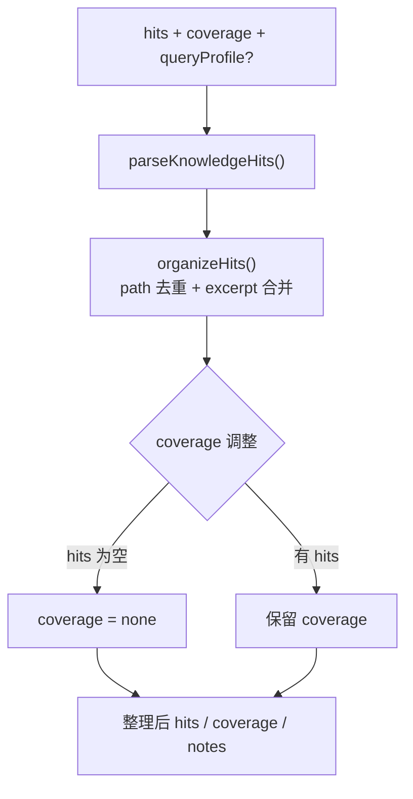

| 步骤 | 做什么 | 规则 | 文件 | 方法 |
|------|--------|------|------|------|
| 1 | 输入 | 上游 KM / list 的 `hits` / `coverage` / `notes` | `content-organizer/prompt.ts` | `ContentOrganizerInput` |
| 2 | Zod 校验 | 丢弃非法 hit 字段 | `content-organizer/schema.ts` | `parseKnowledgeHits()` |
| 3 | path 去重 | 同 path 保留最高 relevance；excerpt 合并（≤320 字） | `organize-hits.ts` | `organizeHits()`, `normalizeDocPath()` |
| 4 | coverage | hits 为空 → `none` | `organize-knowledge.ts` | `organizeKnowledge()` |
| 5 | 编排 | planMerge / listRetriever 后进入 | `content-organizer/content-organizer-node.ts` | `runContentOrganizerNode()` |

**验证：** `pnpm run verify:content-organizer`；全 Agent schema：`pnpm run verify:agent-schemas`。

### 7. DocParser — 文档解析师（D7）✅

**触发：**

- **Web**：`/corpus` 语料导入页（拖放 / 选文件 / 选文件夹）或对话输入框 **+** 附件；`POST /api/documents/upload` → Agents `POST /documents/upload`
- **CLI**：`pnpm run parse:documents -- <path...>`（**无需 userId**；语料归属见 `.env` `FAMBRAIN_CORPUS_USER_ID` 或 `data/doc/users/`）

**不参与**在线聊天问答实时链路（上传后可选重建 Qdrant 索引，再被 KM 检索）。

**职责：** 批量接收 PDF / Word / PPT / 图片 → 解析为 Markdown → 原件存 `vault/originals/uploads` → **按文件自动分类**写入 `corpus/<personal|projects|experience>/imports/` → 可选 `indexOneCorpusUser()`。用户只见摘要：「已导入 N 个文件：个人 X · 项目 Y · 经历 Z，向量库已更新」。

**分类：** `resolveCorpusCategory()` — 路径含 `personal/projects/experience` 优先；否则按文件名 / 标题 / 正文关键词推断；默认 `personal`。CLI `--category` 可整批强制覆盖。

**技术：** pdf-parse、officeparser、mammoth（docx）、Ollama vision OCR（图片）、p-limit 并发、Zod（结果 schema）、Pino。

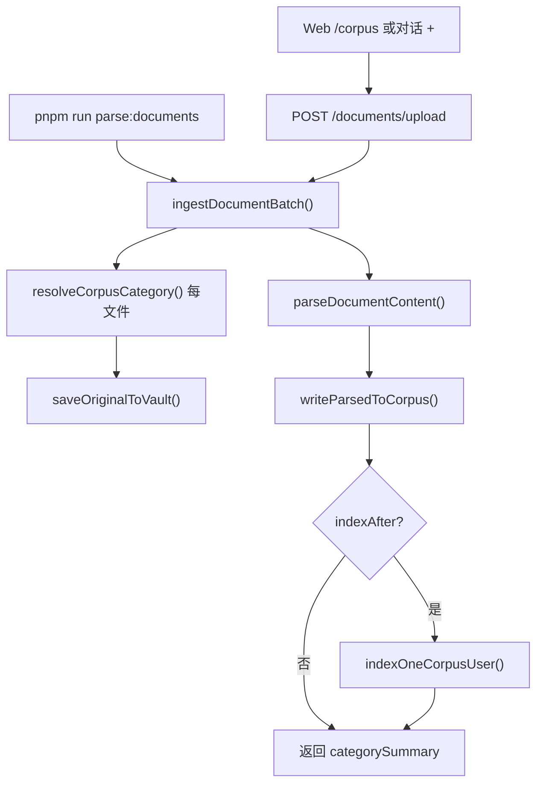

| 步骤 | 做什么 | 规则 | 文件 | 方法 |
|------|--------|------|------|------|
| 0 | HTTP / CLI | JWT 鉴权（Web）；CLI 自动 `resolveDefaultIngestIdentity()` | `documents-upload.ts`, `parse-documents.ts` | `handleDocumentsUpload()` |
| 1 | 分类 | 每文件独立；可选 `relativePaths`（文件夹上传） | `resolve-corpus-category.ts` | `resolveCorpusCategory()` |
| 2 | 存原件 | `users/<actor>/vault/originals/uploads/` | `write-corpus-md.ts` | `saveOriginalToVault()` |
| 3 | 解析 | PDF→pdf-parse；Word→mammoth/docx+officeparser；PPT→officeparser；图片→Ollama OCR | `parse-file.ts`, `parse-image-ocr.ts` | `parseDocumentContent()` |
| 4 | 写 md | `corpus/<category>/imports/` | `write-corpus-md.ts` | `writeParsedToCorpus()` |
| 5 | 入库 | 默认 `indexAfter=true`；Web 大批量客户端分批，末批才 index | `ingest-batch.ts` | `ingestDocumentBatch()` |
| 6 | 并发 | `DOC_PARSE_CONCURRENCY`（默认 2） | `ingest-batch.ts` | `getDocParseConcurrency()` |

**验证：** `pnpm run verify:doc-parser`（格式 / 路径 / 分类单测，不依赖 Ollama）。

### 8. 记忆层 — Mem0 + LangMem（D8）✅

**触发：** 每轮 LangGraph **`prepareTurnStart` 节点**内调用 `preparePipelineMemory()`（`agentflow/agents/online/prepare-turn-start/prepare-turn-start.ts`）。**不参与**离线入库链路。

**职责：** **Mem0** 按 `actorUserId` 检索跨会话偏好/事实；**LangMem** 按 `conversationId` 维护会话摘要（`completeChat`，跟 `CHAT_PROVIDER`）；合并为 `memoryBlock` 注入 **IntakeCoordinator** 与 **InformationAnalyst** prompt。轮次结束后由 **`persistTurnEnd` 节点**写 LangMem；可选静默抽事实写 Mem0。

**P0-16 补充：** 联系方式类 **remember/recall** 走 **userFact 节点**（`addStructuredUserFact` / `searchUserFactMemories`），不依赖轮次后 LLM 抽取；LangMem 仍仅本会话。

**存储：**

| 层 | 落点 |
|----|------|
| Mem0 向量 | Qdrant collection `fambrain_user_memories`（`MEM0_QDRANT_COLLECTION`） |
| Mem0 流水 | `data/memory/mem0/history.db` |
| LangMem | Prisma `Conversation.sessionSummary` / `sessionSummaryAt` |
| 图任务 checkpointer | 官方 `SqliteSaver` → `data/memory/langgraph/checkpoints.db`（可用 `LANGGRAPH_CHECKPOINT_PATH` 覆盖）。**问答 thread** = `fambrain:{conv}:{qaGen}`，新问 discard。**文件 thread** = `fambrain-file:{conv}:{fileGen}`，Resume 只打这一条（`interrupt(vault_wait)` → `Command({ resume: vault_action, jobId })`）。生成停 / 新问 / 停止 = 问答世代 + `deleteThread`。HITL 正文以 interrupt 载荷为准。单测走 MemorySaver。 |

BFF 请求体须带 `conversationId`（`packages/brain-types`）。

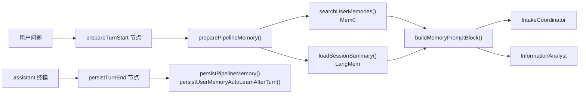

| 步骤 | 做什么 | 配置 | 文件 | 方法 |
|------|--------|------|------|------|
| 0 | 开关 | `MEM0_ENABLED` / `LANGMEM_ENABLED`（默认开） | `memory/config.ts` | `getMemoryConfig()` |
| 1 | 加载 | 检索 Mem0 + 读会话摘要；裁剪 Intake 历史 | `prepare-context.ts` | `preparePipelineMemory()` |
| 2 | 注入 | `memoryBlock` 拼入 system/human | `build-prompt-block.ts` | `buildMemoryPromptBlock()` |
| 3 | 持久化 | LangMem 摘要；可选静默 Mem0 结构化事实 | `persist-turn-end/`、`user-memory-extract/`、`persist-turn.ts` | `runPersistTurnEnd()` |

**验证：**

- `pnpm run verify:memory`（LangMem 跟 `CHAT_PROVIDER`；`MEM0_ENABLED=false` 时测 LangMem→Prisma）
- `pnpm run verify:user-fact`（需 Ollama + Qdrant；Mem0→Qdrant）

### 9. ContentSummarizer — 内容摘要师（D9）✅

**触发：**

1. **在线（主路径）**：Intake 判定 `intent === "summarize_content"` → 可选 KM 检索 → **ContentSummarizer** → 终稿（不经 Analyst）。
2. **CLI**：`pnpm run summarize:document -- <file.md>`（单文件工具，不经过 Intake）。

**职责：** 对检索片段或用户原文生成结构化摘要，格式化为 Markdown 回复（`title` / `summary` / `bullets` / `keywords`）。

| 步骤 | 做什么 | 文件 | 方法 |
|------|--------|------|------|
| 1 | 截断正文（≤12k 字） | `summarize.ts` | `summarizeContent()` |
| 2 | Ollama + Zod | `schema.ts`, `prompt.ts` | `parseContentSummaryResult()` |
| 3 | 读文件 | `summarize-file.ts` | `summarizeMarkdownFile()` |
| 4 | 编排 | `compile.ts` | `contentSummarizerNode()`；`buildSummarizeSourceText()` |
| 5 | 展示 | `format-answer.ts` | `formatSummaryAsAnswer()` |

**在线分支（`compile.ts`）：**

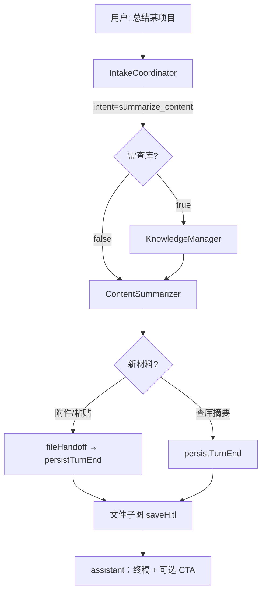

**验证：** `pnpm run verify:content-summarizer`；`verify:agent-schemas`（含 `summarize_content` intent）；CLI 需 Ollama。

### 10. 实验触达 — MCP / Recall / Vercel AI ✅

与主链解耦，脚本在 `apps/brain-service/scripts/experiments/`，说明见 [experiments/README.md](../experiments/README.md)。

| 实验 | 命令 | 作用 |
|------|------|------|
| MCP 列 vault | `pnpm run experiment:mcp-vault` | stdio MCP 工具 `list_vault_files` |
| Recall 对比 | `pnpm run experiment:recall-compare -- <userId> "query"` | Qdrant sparse vs `searchCorpusVectors` |
| Sparse / Hybrid 自测 | `pnpm run verify:sparse-recall` / `verify:hybrid-recall` / `verify:recall-compare` | HY-01～07 |
| Vercel AI SDK | `pnpm run experiment:vercel-ai -- "prompt"` | `streamText` + Ollama（主链仍自研 SSE） |
| LangChain bindTools | `pnpm run experiment:bind-tools -- "问法"` | ReAct 选 StructuredTool；`--schema-only` 不测 Ollama |

**验证：** `pnpm run verify:vault-list`（vault 列举单测）。

### 11. 用户记忆通道（显式 / 静默 / 检索反馈）✅

**三通道（互不替代）：**

| 通道 | 能力 | 代码 / 数据 |
|------|------|-------------|
| **A 显式 remember** | Intake `remember_user_fact` → `addStructuredUserFact` | `user-fact/` · 写时去重 |
| **B 静默自学** | 轮次后**独立 LLM**抽 `{factKey,label,value,confidence}` → 仅 Mem0 | `user-memory-extract/` · `USER_MEMORY_AUTO_LEARN_ENABLED`（默认 **false**） |
| **C 检索反馈** | 聊天消息下 👍/👎 → path 聚合 boost KM rerank | `RetrievalFeedback` · `aggregateFeedbackByPath` |

**静默自学约定：** 只读用户本轮原话；不写 corpus；无 pending / `/learning`；同轮显式 userFact 跳过；置信 < `USER_MEMORY_AUTO_LEARN_MIN_CONFIDENCE`（默认 0.85）丢弃。语义归抽取 LLM；代码只做 Zod 合法化。

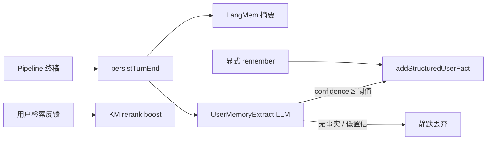

**验证：**

```bash
pnpm --filter @fambrain/brain-service run verify:user-memory-extract
# Web：聊天助手消息下 👍👎 反馈按钮（非 Learning HITL）
```

### 12. LangChain StructuredTool 层 ✅

**定位：** 将已有 FamBrain 能力封装为 LangChain **`tool()`**（Zod schema），供实验性 `bindTools` / 外部 Agent 复用；**主聊天仍走 LangGraph 固定节点**，不由 LLM 自主选工具。

| Tool | 包装 | 说明 |
|------|------|------|
| `retrieve_corpus` | `retrieveKnowledge` | 语料 hybrid 检索，返回 JSON hits |
| `remember_user_fact` | `addStructuredUserFact` | 结构化写入 Mem0 |
| `recall_user_fact` | `searchUserFactMemories` | 跨会话召回 user_fact |
| `list_vault_files` | `listVaultFiles` | vault 只读列举（同 MCP） |
| `summarize_text` | `summarizeContent` | 正文摘要（需 Ollama） |

调用前须 `runWithToolContext({ corpusUserId, actorUserId }, () => tool.invoke(...))` 注入上下文。

**LangSmith：** `bootstrapBrainServiceRuntime()` → `configureLangSmithTracing()`；`graph.stream` 附带 `runName` / `metadata`（conversationId 等）。配 `LANGSMITH_API_KEY` 后在 [smith.langchain.com](https://smith.langchain.com) 查看 trace。

**验证：**

```bash
pnpm --filter @fambrain/brain-service run verify:langchain-tools
pnpm --filter @fambrain/brain-service run verify:vault-list   # vault 底层 API
pnpm --filter @fambrain/brain-service run experiment:bind-tools -- --schema-only
pnpm --filter @fambrain/brain-service run experiment:bind-tools -- "我的名字是什么？"
```

**bindTools 实验（`scripts/experiments/bind-tools-react.ts`）：** 将 4 个工具（不含 `summarize_text`）绑定到 `ChatOllama`，最多 4 轮 tool call → 终稿；与 Golden/eval **完全隔离**。生产聊天仍走 LangGraph 节点。

## 路由字段（IntakeCoordinator 输出）

| 英文字段 | 中文名 | 含义 | 典型去向 |
|----------|--------|------|----------|
| `intent` | 意图类型 | 查库回答 / 直接答 / 澄清 / 闲聊 / 拒答 | 编排器分支 |
| `searchQuery` | 检索查询句 | 去掉寒暄后的检索关键词句 | → KnowledgeManager 入参 |
| `queryType` | 检索问法 | identity / enumeration / tech / **external_link** / **relations** / default | → KM `queryProfile`；relations 滤亲友名册 |
| `subTasks` | 子任务列表 | 复杂问题拆成多句 | → KM / Analyst |
| `topics` | 主题标签 | 如 `resume`、`aky` | → KnowledgeManager 入参 |
| `language` | 回复语言 | `zh` / `en` / `mixed` | → InformationAnalyst 入参 |
| `confidence` | 置信度 | 0–1，可观测、可降级 | 日志 / 后续策略 |
| `clarifyingQuestion` | 澄清提问 | 信息不足时追问一个关键问题 | **直接返回用户** |
| `briefReply` | 简短回复 | 寒暄或拒答（≤80 字） | **直接返回用户** |
| `userFactKey` | 事实键 | 如 `qq` / `phone` / `email` / `wechat` | → **userFact 节点** |
| `userFactLabel` | 展示标签 | 如「QQ号」 | → userFact 召回文案 |
| `userFactValue` | 事实值 | remember 时必填；recall 时为 `null` | → Mem0 写入 / 校验 |

## 编排分支（`pipeline/graph/routes.ts` + `compile.ts`）

| 条件 | 节点顺序 | 用户看到什么 |
|------|----------|--------------|
| `intent === "clarify"` 且 `clarifyingQuestion` 有值 | `respondEarly` | 澄清提问 |
| `intent` 为 `chitchat` / `out_of_scope` 且 `briefReply` 有值 | `respondEarly` | 简短回复 |
| `intent === "summarize_content"` 且需查库（`searchQuery` 非空） | `retrieval` → **contentSummarizer** | 摘要终稿（阅读已有语料，**不出闸**） |
| `intent === "summarize_content"` 且无需查库（粘贴长文） | **contentSummarizer** → **fileHandoff** → persistTurnEnd → 文件子图 saveHitl | 摘要终稿 + 是否入库 |
| `attachmentAction` 为 `summarize` / `translate` | 总结或翻译链 → **fileHandoff** → persistTurnEnd → 文件子图 | 终稿 + 是否入库（聊天附件不再 ingest） |
| `intent` 为 `remember_user_fact` / `recall_user_fact` 且 Intake 填齐 schema | **userFact** → 终稿 | SSE：`user_fact`；**不经 KM / FC / Analyst** |
| `retrieve_and_answer` / composite 等需检索 | `planCacheResolve` → **planFanOut**（km/list/mem/tool/…）→ **contentOrganizer** → **Analyst** | 检索 + 分析终稿 |
| Join 后结构失败槽 | **全局再规划 B**（≤1） | 改 query / 外搜补救；不再打回 FactChecker |
| 其余 | `respondEarly` | 简短说明或请用户补充 |

## 流式 SSE 事件（`POST .../messages`）

| `event` | 含义 |
|---------|------|
| `meta` | 用户消息已落库（含真实 `id`） |
| `step` | 编排进度：**`prepare_turn_start`** / `intake` / **`user_fact`** / `plan_fan_out` / `list_retrieve` / `km_retrieve` / **`content_summarizer`** / **`content_organizer`** / `analyst` / **`file_handoff`** / **`persist_turn_end`** / **`file_agent`**，`status` 为 `running` \| `done`；`done` 时可带 `durationMs`（无 `fact_checker`） |
| `pipeline_timing` | SLO：本轮 `totalMs`、`ttftMs`、各节点 `nodes`（Agents → BFF 转发） |
| `ready` | Pipeline 已出终稿、即将落库（BFF）；前端可提前解锁输入 |
| `thinking` | 信息分析师推理流（若模型/Ollama 支持） |
| `assistant` | 面向用户的正文增量（流结束后以 `answer` 写入 DB） |
| `done` | 流结束，含 user/assistant 消息 id、终稿 `content`、可选 `timing`。生成停也走 `done`（半截稿即终稿） |
| `paused` | 文件子线 HITL（工作台或写回闸门）：`kind=vault_wait`，**必须带 `jobId`** 才能 Resume；**不是**生成停 |
| `main_turn_complete` | 主图已 END（终稿可先落库）；随后可能再出文件 CTA |
| `error` | 模型或编排失败 |
