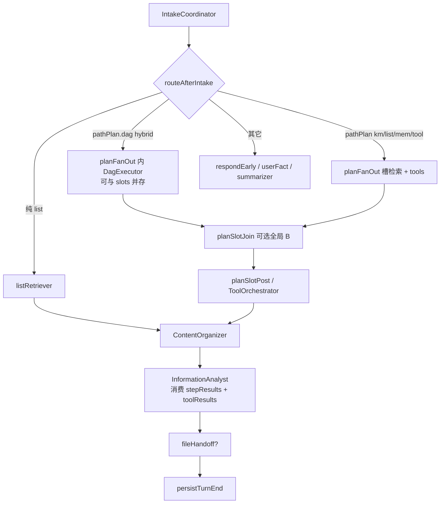
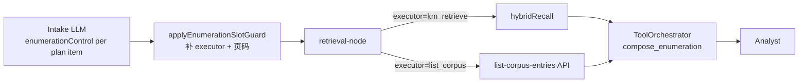
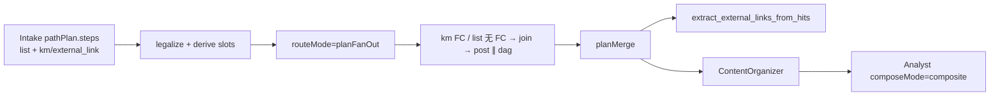
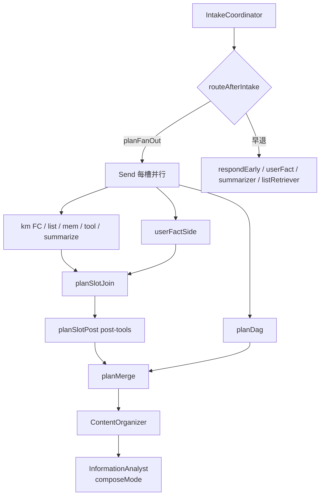

# 架构 v2：四类数据源与工具编排

[← 返回 README](../README.md) · [Agent 流程图](./02-agent-flows.md) · [坑点清单](./04-pitfalls.md)

本文记录 **2026-07** 从 Classic RAG 演进到 **四类问题架构** 的动机与实现，以及 **2026-08** 现网口径：catalog `invokeTool`、双图文件 HITL、Chat 可切换、**不接入 Dify**、P0-34 已清。触发原因是 **年龄计算**（P0-23）暴露了「Analyst 内联硬编码工具」的架构债。

---

## 1. 为什么要改？

### 1.1 导火索：「我今年多大」

| 阶段 | 现象 | 问题 |
|------|------|------|
| P0-15/18 | Analyst prompt **禁止 LLM 自行推算年龄** | 防幻觉正确 |
| P0-23 初版 | `compute_age_from_hits` 写在 **Analyst 内**（`resolveOrchestratedTool`） | 工具层与归纳层耦合；Intake 无 `toolPlan` |
| 用户期望 | 行业惯例：**Intake 规划 → KM 检索 → Tool 执行 → Analyst 只写稿** | 与 LangChain Tool + Orchestrator 分层一致 |

**结论：** 年龄不是「多写一个 regex」能解决的单点 bug，而是缺少 **声明式工具编排层**。本次重构把 P0-23 的能力 **上移到独立 LangGraph 节点**，并顺带落地四类数据源分流。

### 1.2 目标架构（四类）

| 类别 | 示例 | 路径 | LangGraph |
|------|------|------|-----------|
| ① 静态知识 | 文档里写了什么政策 | 本地向量库（Qdrant dense + sparse） | `retrieval` → KM |
| ② 个人信息 / 计算 | 我今年多大 | 语料检索 + **计算工具** | KM → `toolOrchestrator` → `compute_age_from_hits` |
| ③ 实时动态 | xxx 公司最近怎么样 | **联网搜索**（corpus-first） | KM 弱命中 → `search_web` |
| ④ 混合 | 根据简历 + 行情评估去某公司机会 | **DAG 编排** | `dagExecutor` 并行语料+联网 → `synthesize_merge`（**MatchReport 四栏**）→ Analyst 只渲染 |

**原则：** 尽量少硬编码口语；字段 → 工具映射集中在 **`field-catalog.ts`**，Intake guard 只 **富化计划**，不算答案。

---

## 2. Git 提交链路（大版本脉络）

| 提交 | 主题 | 与本次关系 |
|------|------|------------|
| `ab25432` | P0-22 列举分页（`listIntent` / `enumerationPage`） | Intake guard ⑦ 模式 → 本次 guard ⑧ `applyToolPlanGuard` 同级扩展 |
| `c0614e9` | P0-23 年龄编排工具 + `search_web` stub | **触发架构债**；工具逻辑先在 Analyst 内联 |
| **（本次未提交）** | P0-24 四类架构 + `toolOrchestrator` / `dagExecutor` | 将 P0-23 上移到编排节点；落地 Tavily `search_web` |
| **（2026-07）** | P0-26 列举 **per-slot** + 代码布局 `agents/` / `tool-orchestrator/` | 废弃整句 `routeMode=list`；ToolOrchestrator 移入 `agents/online/` |

更早基础：`aec9cdb`（`retrieve_and_answer` 决定是否进 KM）、`c466a28`（LangGraph 纯化）、`12a6b13`（Intake 节点拆分）。

---

## 3. 新 Pipeline 拓扑

> **2026-08：** 主链 **FactChecker 已删**；失败槽补救走 `planSlotJoin` 后全局再规划 B。向量库为 **Qdrant**（语料 dense+sparse 引擎 RRF；Mem0 独立 dense collection）。



**与 P0-23 对比：**

```
# 旧（P0-23）
Intake → KM → FC → CO → Analyst（内联 resolveOrchestratedTool + regex）

# 现网（2026-08）
Intake pathPlan
  → planFanOut（km/list/mem/tool/dag）
  → Join / 可选全局 B（无 FactChecker）
  → Organizer → planSlotPost tools → Analyst
  → fileHandoff? → persistTurnEnd
  文件 HITL 在 sideline/file
```

---

## 4. 核心模块

| 路径 | 职责 |
|------|------|
| `agents/online/tool-orchestrator/field-catalog.ts` | 声明式 identity 字段表（`age` → `compute_age_from_hits`）；混合问句 / 外部事实启发式 |
| `intake-coordinator/path-plan/enrich-tool-plan.ts` | `applyToolPlanGuard`：规划期盖 toolId；混合问句 → `executionPlan` |
| `agents/online/tool-orchestrator/execute/` | 按 toolId 分发；实现在 `agentflow/tools/<name>` |
| `agents/online/dag-executor/` | DAG 拓扑：`executeDagPlan`、`runPlanDagNode` |
| `agents/online/tool-orchestrator/nodes.ts` | `runDagExecutorNode`、`runToolOrchestratorNode` |
| `pipeline/graph/state.ts` | 新增 `asOfDate`、`toolResults` |
| `prepare-turn-start` | 注入 `asOfDate`（年龄计算基准日） |
| `tools/catalog` + `tools/invoke` | 生产 `toolId` 清单与分发（含 `get_weather`） |
| `tools/local/web` | Tavily `search_web`；未配置时 `status=disabled` |
| `tools/mcp/server/weather` | Open-Meteo MCP；pipeline `get_weather` |
| LangChain StructuredTool | 实验 `bindTools`；主链不由模型选工具 |

### 4.1 Intake 新增字段（`RoutedIntakeDecision`）

- `enrichedPlan`：每项含 `dataSource`、`toolId`、`field`
- `executionPlan`：混合 DAG 节点列表
- `routeMode`：新增 `"dag"`

> 注：整轮 `primaryDataSource` / `webQuery` 已移除；联网由槽 `topics.external` → `toolId=search_web` / `pathPlan.tool` 表达。

### 4.2 状态字段

- `asOfDate`：`prepareTurnStart` 写入，供 `compute_age_from_hits`
- `toolResults`：`Record<key, ToolRunResult>`，Analyst 经 `pickToolResultForSubQuestion` 优先消费

### 4.3 向后兼容

- `tools/local/orchestrated/run-sub-question.ts` **保留**：单测与未走 graph 的直调路径仍可用
- Analyst `buildSubQuestionFallbackAnswer`：**先读 `toolResults`，再 fallback 到 orchestrated**

---

## 5. 环境变量

```bash
# .env（根目录唯一来源）
TAVILY_API_KEY=...              # 或 FAMBRAIN_TAVILY_API_KEY
FAMBRAIN_WEB_SEARCH_ENABLED=1   # 显式开启联网（无 key 仍 disabled）
```

corpus-first 不变：主路径仍先 KM；仅槽 `topics.external` / `pathPlan.tool` 时 `ToolOrchestrator` 调 `search_web`。

---

## 6. 验证命令

```bash
pnpm --filter @fambrain/brain-service run verify:tool-orchestration
pnpm --filter @fambrain/brain-service run verify:dag-hybrid
pnpm --filter @fambrain/brain-service run verify:orchestrated-identity
pnpm --filter @fambrain/brain-service run verify:composite-route
pnpm --filter @fambrain/brain-service run verify:langchain-tools
```

---

## 7. 后续改进方向

| 项 | 说明 |
|----|------|
| 混合 DAG 由 Intake 写齐 `nodes[]` / `executionPlan` | 拓扑执行 `deps`；`synthesize_merge` 默认 `free`，岗位匹配才 `match_report`；不并入 ReAct |
| `field-catalog` 扩展 | 新计算字段只加 catalog 映射，不加口语 if |
| bind-tools | **保持实验**（`experiments/bind-tools-react.ts`）；主链不让模型自主选工具 |

---

## 8. 相关文档

- [Agent 流程图 · ToolOrchestrator / DagExecutor](./02-agent-flows.md)
- [坑点 §2.5.7 identity 年龄](./04-pitfalls.md#257-identity-年龄编排工具-p0-23--2026-07)（已更新 P0-24 架构）
- [坑点 §2.5.10 列举 per-slot](./04-pitfalls.md#2510-列举执行-per-slot-架构升级-p0-26--2026-07)
- [KM 检索设计](./km-retrieval-design.md)

---

## 9. 代码布局演进（2026-07）

> **动机：** 业务 Agent 代码与应用包 `apps/brain-service` **同名**（`agentflow/brain-service/`），新人读文档、搜路径时易混淆；`ToolOrchestrator` / `DagExecutor` 在文档里是正式 Agent 角色，实现却落在 `agentflow/tool-orchestration/`，与 `intake-coordinator`、`knowledge-manager` 等 **不同级**，`compile.ts` 接线时 mental model 断裂。

### 9.1 变更对照

| 旧路径 | 新路径 | 原因 |
|--------|--------|------|
| `agentflow/brain-service/online/` | `agentflow/agents/online/` | 与应用名脱钩；`agents` = 全部 Agent 实现 |
| `agentflow/brain-service/offline/` | `agentflow/agents/offline/` | 同上 |
| `agentflow/tool-orchestration/` | `agentflow/agents/online/tool-orchestrator/` | 与 Intake / KM / Analyst **同级**；图节点实现归 online Agent |
| `agentflow/pipeline/` | **不变** | LangGraph **编排骨架**（state / routes / compile / SSE runtime） |
| `agentflow/tools/` | catalog + invoke | 生产 `toolId` 分发；LangChain StructuredTool 仅实验 |
| `agentflow/utils/` | **不变** | 跨 Agent 的 LLM / Zod 小工具，非业务域 |

### 9.2 目标目录树

```
agentflow/
├── agents/
│   ├── online/          # IntakeCoordinator, KM, ToolOrchestrator, Analyst, …
│   └── offline/         # Indexer, DocParser
├── pipeline/            # graph/ + runtime/（只接线，不写业务）
├── tools/               # retrieve_corpus, search_web, …
├── utils/               # parseJsonObject, zod-utils, …
└── index.ts             # 对外 export
```

### 9.3 导入约定

跨目录引用走模块 **index** barrel，例如：

```ts
import { applyToolPlanGuard } from "@/agentflow/agents/online/intake-coordinator";
import { runToolOrchestratorNode } from "@/agentflow/agents/online/tool-orchestrator";
```

详见 [`.cursor/rules/module-folder-conventions.mdc`](../.cursor/rules/module-folder-conventions.mdc)。

---

## 10. 列举执行 per-slot 演进（2026-07）

> **触发：** P0-22 列举分页上线后，穷举仍用 **整句 `routeMode=list`**；P0-26 混合问句暴露「整句只能一种执行模式」的架构上限。详见 [坑点 §2.5.10](./04-pitfalls.md#2510-列举执行-per-slot-架构升级-p0-26--2026-07)。

### 10.1 旧模型 vs 新模型

| 维度 | 旧（P0-22 初版） | 新（P0-26） |
|------|------------------|-------------|
| 穷举路由 | 整句 **`routeMode=list`** | **`routeMode=plan`** + N 槽各带 executor |
| 续问识别 | `enumeration-list-intent` **口语 regex** | Intake **`enumerationControl`** 或 UI **exact-match prompt** |
| KM 执行 | list 与 hybrid **互斥整句分支** | **`retrieval-node` 按槽**：`km_retrieve` ∥ `list_corpus` |
| 混合问 | 无法同轮 tech + 穷举 | 一槽 hybrid、一槽 list API |

### 10.2 数据流



### 10.3 与 P0-24 工具编排的关系

- **取数**（KM / list API）在 **`retrieval-node` 按槽** 完成。
- **成稿**（blocks + 分页文案）仍由 **`ToolOrchestrator` → `compose_enumeration`** 确定性输出。
- Analyst **不**再内联列举 regex，只消费 `toolResults` + 整理后的 hits。

**验证：** `verify:enumeration-pagination`（含混合 2 槽）、`verify:enumeration-compose`。

---

## 11. PathPlan 统一执行计划（2026-07）

> **触发：** 混合问「列举全部项目 + 开源 GitHub 链接」在 UI 上只答出一段（或错段）；根因是 **routeMode / compositeSlots / toolPlan / dag** 四套「多槽」互斥，Intake 与执行层语义不一致。详见 [坑点 §2.8](./04-pitfalls.md#28-pathplan-统一编排-p0-28--2026-07)。

### 11.1 问题：四套多槽各说各话

| 旧层 | 表达什么 | 冲突点 |
|------|----------|--------|
| `routeMode` | ~~整句互斥 / 可观测 skip\|plan~~ → **与图节点 1:1** | Intake 出口写入；`routes.ts` 只读分发；执行在节点内 |
| `compositeSlots` | KM / list 并行槽 | dag 步不进槽；顺序跟 `pathPlan.steps` |
| `executionPlan` | 混合 DAG | 与槽并存于 planExecutor |
| 全局再规划 B | Join 后结构失败槽补救（≤1） | **已替代**整轮 FactChecker 打回 |

### 11.2 PathPlan 有序 steps[] + Compose 一层

Intake LLM **直接产出**有序 `pathPlan.steps[]` + `composeMode`；pipeline **`legalizePathPlan` + `normalizePathPlanSteps`** 后按数组顺序派生 `compositeSlots`：

- `kind=km|list|mem|tool|summarize|dag`（Send 工人族）
- `dataSource`：corpus|compute|web|mem0|user_text|synthesize
- 结构归一：`userFactKey` 无 `identityField` → mem；`dataSource=web` + 非 post-tool → tool；**无 Mem0 字段名表**
- 独立工具扩展：加 `TOOL_RUN_IDS` + execute case（不进 `POST_RETRIEVAL_TOOL_IDS`）→ 自动 `toolRetrieve`


```typescript
type PathKind = "km" | "list" | "mem" | "tool" | "summarize" | "dag" | "vault_workspace";

type ExecutionStep = {
  id: string;
  kind: PathKind;
  label: string;
  searchQuery: string;
  queryType: "identity" | "enumeration" | "tech" | "external_link" | "relations" | "default";
  topics: string[];
  identityField?: string | null;
  toolId?: string | null;
  dataSource?: "corpus" | "web" | "compute" | "synthesize" | "mem0" | "user_text" | null;
  userFactKey?: string | null;
  userFactLabel?: string | null;
  enumerationControl?: EnumerationControl | null;
  nodes?: DagNodeSpec[]; // 仅 dag：有向节点 + deps
  deps?: string[];
};

type PathPlan = {
  steps: ExecutionStep[]; // 数组顺序 = 回答/执行顺序
};

type ComposeMode = "qa" | "summarize" | "composite";
```

| kind | Send 工人 | FC |
|------|------|-----|
| `km` | `kmRetrieve` | **per-step** |
| `list` | `listRetrieve` | **跳过** |
| `mem` | `memRetrieve`（Mem0） | **跳过** |
| `tool` | `toolRetrieve`（独立工具） | **跳过** |
| `summarize` | `summarizeSlot` | **跳过** |
| `dag` | `planDag`（`nodes[]` 拓扑） | 节点级 |

**Compose 只做一次：** 全部 step 完成后，Analyst 按 `composeMode` 输出单答 / 多段 composite / 摘要；**回答顺序 = `pathPlan.steps` 数组顺序**（不做 list→km 重排）。整轮 `composeMode=summarize` 仍走 `contentSummarizer` 终稿节点。

### 11.3 列举 + 外链（无场景 DAG）

用户问：「列出全部项目 + 开源 GitHub 地址」



- `external_link` 进 **km** 步 + 声明式 `toolId=extract_external_links_from_hits`（实现在 **`tools/lib/extract-external-links.ts`**；Intake 只填 queryType + toolId）；**禁止**再加 `opensource_links` / `dag-github-links` 一类场景 named DAG。
- 工具层 strip「近两年」等时间口语（实体 token）；时间窗走 `enumerationControl.timeWindowYears`。
- dag 为 `nodes[]` 有向图（无 named template）。`synthesize_merge` 默认 free；`match_report` 须显式声明。
- 回答顺序 = Intake `steps[]` / 派生 `compositeSlots` 顺序；searchQuery 用 **`EXTERNAL_LINK_SLOT`** canonical（P0-27）。
- 列举分页 / UI exact-match 实现在 **`corpus-lister/enumeration`**（Intake 经 barrel re-export，无独立 enumeration 目录）。

### 11.3b 匹配结构化（MatchReport · synthesize_merge）

`synthesize_merge` 默认 `schema=free`（按节点 goal 汇合 deps）。仅当 Intake 写 `synthesizeSchema: "match_report"` 才走固定四栏：

| 层 | 内容 |
|----|------|
| L1 | Markdown 四栏：`## 匹配点` / `## 缺口` / `## 风险/不确定` / `## 结论` |
| L2 | `MatchReport` JSON（Zod）；`ToolRunResult.matchReport` |
| L3 | 证据不足时结论不得为「适合」；软依赖降级写入风险栏 |
| L4 | Analyst **直接渲染** `synthesize_merge`（`pickToolResult` / `assistantBlocks`），禁止二次散文覆盖 |
| L5 | eval `E2E-dag-job-fit`（`expectMatchReport`）；`verify:dag-hybrid`；单测 `match-report.test.ts` |

结论枚举仅：`适合` \| `谨慎` \| `信息不足`。`SYNTHESIZE_MATCH_LLM=0` 可关 LLM 填表（单测默认关）。

实现：`agentflow/tools/local/synthesize/`。

### 11.4 新 Pipeline 拓扑



**代码：** `intake-coordinator/path-plan/*` · `plan-fanout/` · `user-fact/mem-retrieve` · `tool-orchestrator/tool-retrieve` · `content-summarizer/slot` · `pipeline/graph/compile.ts`。

**验证：**

```bash
pnpm --filter @fambrain/brain-service run verify:composite-route
pnpm --filter @fambrain/brain-service run verify:composite-incremental
pnpm --filter @fambrain/brain-service run verify:tool-orchestration
pnpm --filter @fambrain/brain-service run verify:dag-hybrid
pnpm --filter @fambrain/brain-service run eval:run   # 含 six-composite-qq-phone + GMem
```

---

## 12. Intake LLM 主导 + schema 兜底（2026-07 · 去问句硬编码）

> **触发：** 超长复合问（从业年限 / 公司职位 / 近两年项目 / 年龄姓名 / 全量项目 / 开源链接）出现 **重复槽**、任职表头误标「项目名称」、年限只算近段、近两年未过滤；同时 `IDENTITY_FIELD_SEARCH.labels` 等口语词表变成「代码二次 Intake」。详见 [坑点 §2.9](./04-pitfalls.md#29-intake-去硬编码与复合履历-p0-30--2026-07)、规则 [`.cursor/rules/no-scene-hardcoding.mdc`](../.cursor/rules/no-scene-hardcoding.mdc)。

### 12.1 分工

| 层 | 职责 | 禁止 |
|----|------|------|
| **Intake LLM** | 合并语义相同子问、拆独立槽；**`retrieve_and_answer` 必填 `retrievalPlan≥1`**；填齐 `queryType` / `identityField` / `enumerationControl`（含 `timeWindowYears`） | — |
| **代码兜底** | Zod 合法化（非法类型/别名）；按 facet key **去重**；**空 plan → clarify**（不包 1 槽 default 壳） | 口语 `labels.includes` / 问句 regex 猜意图；`filled_fallback` / subTasks 拆 plan |
| **执行层** | `identityField` → `toolId`；`listKind` → 目录扫描；语料结构抽取（日期/URL/表头） | 写死年份/公司/项目名 |

### 12.2 关键能力

| 能力 | 结构化字段 | 执行 |
|------|------------|------|
| 从业年限 | `identityField: tenure` | `compute_tenure_from_hits`（简历时间线最早起点） |
| 近 N 年列举 | `enumerationControl.timeWindowYears` | `list_corpus` 扫盘后按 path/正文年份过滤 |
| 公司+职位 | 单条 `listKind=experience` | 列举文案/UI 带职位；表头信 `listKind` |
| 同 facet 去重 | `(queryType, identityField\|listKind, timeWindowYears)` | `repair-retrieval-plan` / `dedupePlanByFacet` |

### 12.3 代码地图

| 路径 | 说明 |
|------|------|
| `intake-coordinator/composite/identity-field-search.ts` | 仅 `displayLabel` + `searchQuery`（**无**口语 labels） |
| `intake-coordinator/composite/repair-retrieval-plan.ts` | schema normalize + facet 去重 |
| `intake-coordinator/path-plan/` | PathPlan `steps[]` 合法化/派生；禁止场景 named DAG |
| `tools/lib/compute-tenure.ts` / `extract-*.ts` | 确定性工具 |
| `corpus-lister/list/entry-time-window.ts` | 时间窗 / 角色抽取 |
| `apps/brain-service/tests/` | 单元测试集中目录（勿再写 `src/**/*.test.ts`） |

### 12.4 验证

```bash
pnpm test:unit
pnpm --filter @fambrain/brain-service exec tsx --env-file=../../.env scripts/diagnose-long-composite-career-query.ts
pnpm --filter @fambrain/brain-service exec tsx --env-file=../../.env scripts/diagnose-mixed-projects-github-query.ts
```

---

## 13. Intake 档 B：主路径规划 + 旁路纠偏（2026-07）

> **触发：** 短续问盲预合并误伤换题；单字乱敲浪费 token；用散文 clarify 兜底驱动指代重试，复盘时分不清「LLM 规划」与「代码二次 Intake」。详见 [坑点 §2.10](./04-pitfalls.md#210-intake-档-b主路径规划--旁路纠偏-p0-31--2026-07)。

### 13.1 分工（定型）

| 层 | 职责 | 禁止 |
|----|------|------|
| **主路径（LLM）** | 产出执行终稿：`intent` / **`pathPlan.steps`≥1**（retrieve 时；`answerOrder` 可选）/ `composeMode` / `searchQuery` / `coreference` | 依赖代码猜口语、发明多槽、按 queryType 猜桶 |
| **旁路·入口** | normalize（压连续重复码点）→ 单字/社交/UI 短路 | NFKC 改写标点导致与 history 对不上；盲预合并 |
| **旁路·格式** | 非 JSON → 格式修复 **1** 次 | 把散文当 `coreference` 信号 |
| **旁路·指代** | **coreference=unresolved** + **JSON peek** → 拼接「上轮；本轮」再调 **1** 次 | 无限重试；代码猜 intent/plan；无上文硬拼 |
| **旁路·guard** | toolId 白名单、link **harmonize**、list 页码、**派生** compositeSlots（空 steps→clarify） | `filled_fallback` / continuation 补 prior / 口语二次规划 / retrievalPlan 编译猜桶 |

### 13.2 为何比「调用前合并」更合理

1. **指代是否成立是语义问题**，句长启发会误伤换题短句 → 先让模型标 `coreference`，未消解再拼。
2. **散文失败是输出纪律问题**，应修 prompt / JSON 修复，而不是用 `clarifyFallbackFromProse` 假装已结构化。
3. **复盘路径变短**：日志 `JSON格式修复重试` / `指代拼接重试` / `guard_*` 各司其职。

### 13.3 验证

```bash
pnpm exec vitest run apps/brain-service/tests/intake-coordinator/effective-intake-question.test.ts
pnpm --filter @fambrain/brain-service run verify:intake-coreference
```

---

## 14. P0-34 猜模型意图兜底已清（2026-08）

> **问题：** P0-30/31 已定「意图归 LLM、代码只 schema 合法化」。本地小模型时期叠过亲友改写、`km-qq`→mem、空 plan→remember、年龄口语 regex。
>
> **2026-08：** `CHAT_PROVIDER=openai`（DeepSeek Flash）后，上述猜意图抬升 **已删**。只留 Zod 合法化、空 plan→clarify、`topics=family`→relations、UI exact-match。外链 label 剥词仍在（不改路由）。
>
> **不接入 Dify。** 提示词与 schema 留在仓库；复盘先看 Intake JSON，不要再加代码抬升。
>
> 清单见 [坑点 §2.11](./04-pitfalls.md#211-猜模型意图兜底债-p0-34-intake-主债已清--2026-08)。

| 已删除 | 保留（schema→executor / 合法化） |
|--------|----------------------------------|
| 亲友 searchQuery 改写、`km-qq`→mem、空 plan→remember、年龄口语 regex、无 key 发明字段名 | Zod 合法化、空 plan→clarify、`topics=family`→relations、UI exact-match |

**验证：** `eval:run -- --mem-only` · `--case E2E-six-composite-qq-phone` · **`--case E2E-brother`** · **`--case G5b`** · 全量 `eval:run` · `test:unit`。
